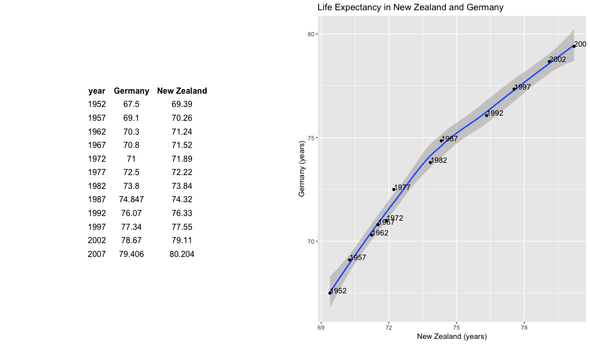
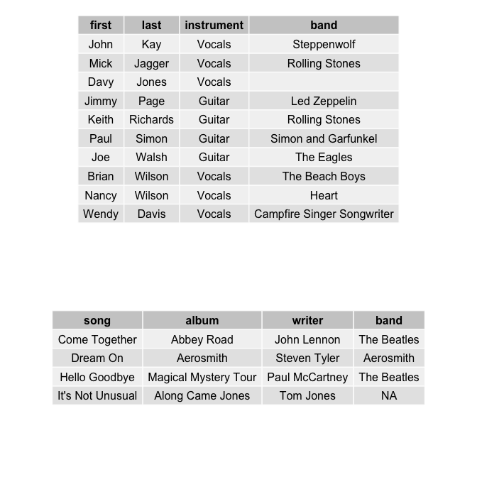

Homework 4: Tidy data and joins
================

## Load packages

``` r
suppressPackageStartupMessages(library(tidyverse))
suppressPackageStartupMessages(library(gapminder))
suppressPackageStartupMessages(library(gridExtra))
suppressPackageStartupMessages(library(knitr))
```

# Data Reshaping (and relationship to aggregation)

**Problem**: I have data in one “shape” but wish it were in another.
Usually this is because the alternative shape is superior for presenting
a table, making a figure, or doing aggregation and statistical analysis.

## Functions

**Solution**: I reshape my data. For simple reshaping, `gather()` and
`spread()` from tidyr will suffice. I could also try using `separate()`
and `unite()`.

> `gather(data, key = "key", value = "value", ...)`: Collapse multiple
> columns into key-value pairs, duplicating all other columns as needed.

> `spread(data, key, value, ...)`: Spread a key-value pair across
> multiple columns.

> `separate(data, col, into, ...)`: Turns a single character column into
> multiple columns, given a regualr expression or a vector of character
> positions.

> `unite(data, col, ...)`: Convenience function to paste together
> multiple columns into one.

Resources:

  - [tidyr in a
    Nutshell](https://github.com/trinker/tidyr_in_a_nutshell)
  - [tidyverse documentation](https://tidyr.tidyverse.org/index.html)

## Activity 2: Life expectancy in Germany and New Zealand

For this activity I will make a tibble with one row per year and columns
for life expectancy for Germany and New Zealand. I will challange myself
by trying to write the least amount of code possible for this exercise
and directly output a table and a scatterplot for comparison next to
each other. I can leverage `spread()` to reshape my data for visual
display and further scatterplot analysis. Let’s start:

``` r
# select values for countries of interest and
# create the table using `spread()`
lifexp_table <- gapminder %>%
  filter(country %in% c("Germany", "New Zealand")) %>% 
  select(country, year, lifeExp) %>% 
  spread(key = country, value = lifeExp) # reshape data frame to multiple columns

# create the scatterplot using the new table
lifexp_plot <-  lifexp_table %>%
  ggplot(aes(`New Zealand`, `Germany`)) +
  geom_smooth(method = 'loess') +
  geom_point() +
  geom_text(aes(label=year),hjust=0, vjust=0) + # add year to point data
  labs(title="Life Expectancy in New Zealand and Germany",
       x="New Zealand (years)",
       y="Germany (years)")

grid.arrange(tableGrob(lifexp_table, rows=NULL, theme=ttheme_minimal()), lifexp_plot, nrow=1) # put table next to plot
```



We can of course also use `knitr::kable()` to make this table look
pretty in my rendered homework. I however prefere the previously used
`tableGrob` and use `grid.arrange` to display table and scatterpot next
to each other.

``` r
kable(lifexp_table)
```

| year | Germany | New Zealand |
| ---: | ------: | ----------: |
| 1952 |  67.500 |      69.390 |
| 1957 |  69.100 |      70.260 |
| 1962 |  70.300 |      71.240 |
| 1967 |  70.800 |      71.520 |
| 1972 |  71.000 |      71.890 |
| 1977 |  72.500 |      72.220 |
| 1982 |  73.800 |      73.840 |
| 1987 |  74.847 |      74.320 |
| 1992 |  76.070 |      76.330 |
| 1997 |  77.340 |      77.550 |
| 2002 |  78.670 |      79.110 |
| 2007 |  79.406 |      80.204 |

# Join (join, merge, look up)

**Problem**: I have two data sources and need information from both in
one new data object.

**Solution**: Perform a join, which borrows terminology from the
database world, specifically
SQL.

**Functions**:

| function name | purpose                                                                                                                  | type of join |
| ------------- | ------------------------------------------------------------------------------------------------------------------------ | ------------ |
| inner\_join() | Returns all rows from x where there are matching values in y, and all columns from x and y.                              | mutating     |
| semi\_join()  | Returns all rows from x where there are matching values in y, keeping just the columns from x.                           | filering     |
| left\_join()  | Returns all rows from x, and all columns from x and y.                                                                   | mutating     |
| right\_join() | Returns all rows from y, and all columns from x and y.                                                                   | mutating     |
| full\_join()  | Returns all rows and all columns from both x and y. Where there are not matching values, returns NA for the one missing. | mutating     |
| anti\_join()  | Returns all rows from x where there are not matching values in y, keeping just columns from x.                           | filtering    |

In this activity I will create my own joins cheatsheet patterned after
[Jenny’s](http://stat545.com/bit001_dplyr-cheatsheet.html)

Other good reseources to read about joins are:

  - The [Relational data
    chapter](http://r4ds.had.co.nz/relational-data.html) in R for Data
    Science.
  - Handling [missing
    values](https://tidyr.tidyverse.org/reference/drop_na.html) in a
    dataframe.

### My data

I will work with two small data frames, `artists` and `songs`.

``` r
artists <- tribble( # create a tibble
                    ~first, ~last, ~instrument, ~band,
                    "John", "Kay", "Vocals",  "Steppenwolf",
                    "George", "Harrison", "Guitar", "The Beatles",
                    "Mick", "Jagger", "Vocals", "Rolling Stones",
                    "Tom", "Jones", "Vocals", NA,
                    "Davy", "Jones", "Vocals", "",
                    "John", "Lennon", "Guitar", "The Beatles",
                    "Paul", "McCartney", "Bass", "The Beatles",
                    "Jimmy", "Page", "Guitar", "Led Zeppelin",
                    "Joe", "Perry", "Guitar", "Aerosmith",
                    "Keith", "Richards", "Guitar", "Rolling Stones", 
                    "Paul", "Simon", "Guitar", "Simon and Garfunkel",
                    "Ringo", "Starr", "Drums", "The Beatles",
                    "Joe", "Walsh", "Guitar", "The Eagles",
                    "Brian", "Wilson", "Vocals", "The Beach Boys",
                    "Nancy", "Wilson", "Vocals", "Heart",
                    "Wendy", "Davis", "Vocals", "Campfire Singer Songwriter"
                    )

songs <-   "
              song,               album,          writer,        band      
     Come Together,           Abbey Road,    John Lennon, The Beatles
          Dream On,            Aerosmith,   Steven Tyler,   Aerosmith
     Hello Goodbye, Magical Mystery Tour, Paul McCartney, The Beatles
  It's Not Unusual,     Along Came Jones,      Tom Jones,          "
  
songs <- read_csv(songs, skip = 1) 
# another way to create a tibble through loading a `.csv` file
```

### inner\_join()

> `inner_join(x,y)` Return all rows from x where there are matching
> values in y, and all columns from x and y. If there are multiple
> matches between x and y, all combination of the matches are returned.

``` r
inner_join <- inner_join(artists, songs)
#> Joining, by = "band"
kable(inner_join)
```

| first  | last      | instrument | band        | song             | album                | writer         |
| :----- | :-------- | :--------- | :---------- | :--------------- | :------------------- | :------------- |
| George | Harrison  | Guitar     | The Beatles | Come Together    | Abbey Road           | John Lennon    |
| George | Harrison  | Guitar     | The Beatles | Hello Goodbye    | Magical Mystery Tour | Paul McCartney |
| Tom    | Jones     | Vocals     | NA          | It’s Not Unusual | Along Came Jones     | Tom Jones      |
| John   | Lennon    | Guitar     | The Beatles | Come Together    | Abbey Road           | John Lennon    |
| John   | Lennon    | Guitar     | The Beatles | Hello Goodbye    | Magical Mystery Tour | Paul McCartney |
| Paul   | McCartney | Bass       | The Beatles | Come Together    | Abbey Road           | John Lennon    |
| Paul   | McCartney | Bass       | The Beatles | Hello Goodbye    | Magical Mystery Tour | Paul McCartney |
| Joe    | Perry     | Guitar     | Aerosmith   | Dream On         | Aerosmith            | Steven Tyler   |
| Ringo  | Starr     | Drums      | The Beatles | Come Together    | Abbey Road           | John Lennon    |
| Ringo  | Starr     | Drums      | The Beatles | Hello Goodbye    | Magical Mystery Tour | Paul McCartney |

Inner joins only retain observations that appear in both datasets.
Therefore we loose all band members that are not in either “The
Beatles”, “Aerosith” or have no value “NA”. This also displays that
`inner_join()` saves multiple matches. Here we automatically joined on
the variable `band`, since our `songs` dataset displayes multiple of
`The Beatles` songs. Every observation of a `song` from `The Beatles` is
therefore connected to every artist (`first`, `last`) who played in `The
Beatles` and we find the artist’s name twice, connected to two `songs`.

Using this join it is extremely important to be aware of “NA” values.
I’ll give an example:

``` r
artists_NAvalues <- tribble( # create a tibble
                    ~first, ~last, ~instrument, ~band,
                    "Stefanie", "Lumnitz", "Guitar", NA,
                    "George", "Harrison", "Guitar", "The Beatles",
                    "Mick", "Jagger", "Vocals", "Rolling Stones",
                    "Tom", "Jones", "Vocals", NA)

inner_join(artists_NAvalues, songs)
#> Joining, by = "band"
#> # A tibble: 4 x 7
#>   first   last    instrument band      song       album         writer    
#>   <chr>   <chr>   <chr>      <chr>     <chr>      <chr>         <chr>     
#> 1 Stefan… Lumnitz Guitar     <NA>      It's Not … Along Came J… Tom Jones 
#> 2 George  Harris… Guitar     The Beat… Come Toge… Abbey Road    John Lenn…
#> 3 George  Harris… Guitar     The Beat… Hello Goo… Magical Myst… Paul McCa…
#> 4 Tom     Jones   Vocals     <NA>      It's Not … Along Came J… Tom Jones
```

Now suddenly me and Tom Jones wrote the song “It’s Not Unusual” since
the `inner_join()` used the variable `band` and me and Tom Jones are not
in a band according to our dataset. Therefore if we work with dataframes
in R it is always important to know your data and if necessary remove
`NA` containing rows or replace the values to avoid miss information. We
can use `drop_na()` for this:

``` r
artists_clean <- drop_na(artists_NAvalues)
inner_join(artists_clean, songs)
#> Joining, by = "band"
#> # A tibble: 2 x 7
#>   first  last    instrument band      song       album          writer    
#>   <chr>  <chr>   <chr>      <chr>     <chr>      <chr>          <chr>     
#> 1 George Harris… Guitar     The Beat… Come Toge… Abbey Road     John Lenn…
#> 2 George Harris… Guitar     The Beat… Hello Goo… Magical Myste… Paul McCa…
```

### semi\_join()

> `semi_join(x, y)`: Returns all rows from x where there are matching
> values in y, keeping just columns from x.

``` r
semi_join(artists, songs) %>% 
  kable()
#> Joining, by = "band"
```

| first  | last      | instrument | band        |
| :----- | :-------- | :--------- | :---------- |
| George | Harrison  | Guitar     | The Beatles |
| Tom    | Jones     | Vocals     | NA          |
| John   | Lennon    | Guitar     | The Beatles |
| Paul   | McCartney | Bass       | The Beatles |
| Joe    | Perry     | Guitar     | Aerosmith   |
| Ringo  | Starr     | Drums      | The Beatles |

This is a really good example of how `semi_join()` can also be described
as a filtering join. In comparison the the `inner_join()` the
`semi_join()` will never duplicate matching rows of `artists` and
therefore does not show us duplicated first and last names.

### left\_join()

> `left_join(x, y)`: Returns all rows from x, and all columns from x and
> y. If there are multiple matches between x and y, all combination of
> the matches are returned. This is a mutating join

Join matching rows from `b` to `a` by matching “x1” variable

``` r
left_join(artists, songs) %>% 
  kable()
#> Joining, by = "band"
```

| first  | last      | instrument | band                       | song             | album                | writer         |
| :----- | :-------- | :--------- | :------------------------- | :--------------- | :------------------- | :------------- |
| John   | Kay       | Vocals     | Steppenwolf                | NA               | NA                   | NA             |
| George | Harrison  | Guitar     | The Beatles                | Come Together    | Abbey Road           | John Lennon    |
| George | Harrison  | Guitar     | The Beatles                | Hello Goodbye    | Magical Mystery Tour | Paul McCartney |
| Mick   | Jagger    | Vocals     | Rolling Stones             | NA               | NA                   | NA             |
| Tom    | Jones     | Vocals     | NA                         | It’s Not Unusual | Along Came Jones     | Tom Jones      |
| Davy   | Jones     | Vocals     |                            | NA               | NA                   | NA             |
| John   | Lennon    | Guitar     | The Beatles                | Come Together    | Abbey Road           | John Lennon    |
| John   | Lennon    | Guitar     | The Beatles                | Hello Goodbye    | Magical Mystery Tour | Paul McCartney |
| Paul   | McCartney | Bass       | The Beatles                | Come Together    | Abbey Road           | John Lennon    |
| Paul   | McCartney | Bass       | The Beatles                | Hello Goodbye    | Magical Mystery Tour | Paul McCartney |
| Jimmy  | Page      | Guitar     | Led Zeppelin               | NA               | NA                   | NA             |
| Joe    | Perry     | Guitar     | Aerosmith                  | Dream On         | Aerosmith            | Steven Tyler   |
| Keith  | Richards  | Guitar     | Rolling Stones             | NA               | NA                   | NA             |
| Paul   | Simon     | Guitar     | Simon and Garfunkel        | NA               | NA                   | NA             |
| Ringo  | Starr     | Drums      | The Beatles                | Come Together    | Abbey Road           | John Lennon    |
| Ringo  | Starr     | Drums      | The Beatles                | Hello Goodbye    | Magical Mystery Tour | Paul McCartney |
| Joe    | Walsh     | Guitar     | The Eagles                 | NA               | NA                   | NA             |
| Brian  | Wilson    | Vocals     | The Beach Boys             | NA               | NA                   | NA             |
| Nancy  | Wilson    | Vocals     | Heart                      | NA               | NA                   | NA             |
| Wendy  | Davis     | Vocals     | Campfire Singer Songwriter | NA               | NA                   | NA             |

As we can see, this table includes all column names `first`, `last`,
`instrument`, `band`, `song`, `album`, `writer`. Futhermore all
combinations of matches were returned as seen on the two rows for each
name out of `The Beatles` for both songs in our data frame.

### right\_join()

> `right_join()`: Returns all rows from y, and all columns from x and y.
> Rows in y with no match in x will have NA values in the new columns.
> If there are multiple matches between x and y, all combinations of the
> matches are returned.

``` r
right_join(artists, songs) %>% 
  kable()
#> Joining, by = "band"
```

| first  | last      | instrument | band        | song             | album                | writer         |
| :----- | :-------- | :--------- | :---------- | :--------------- | :------------------- | :------------- |
| George | Harrison  | Guitar     | The Beatles | Come Together    | Abbey Road           | John Lennon    |
| John   | Lennon    | Guitar     | The Beatles | Come Together    | Abbey Road           | John Lennon    |
| Paul   | McCartney | Bass       | The Beatles | Come Together    | Abbey Road           | John Lennon    |
| Ringo  | Starr     | Drums      | The Beatles | Come Together    | Abbey Road           | John Lennon    |
| Joe    | Perry     | Guitar     | Aerosmith   | Dream On         | Aerosmith            | Steven Tyler   |
| George | Harrison  | Guitar     | The Beatles | Hello Goodbye    | Magical Mystery Tour | Paul McCartney |
| John   | Lennon    | Guitar     | The Beatles | Hello Goodbye    | Magical Mystery Tour | Paul McCartney |
| Paul   | McCartney | Bass       | The Beatles | Hello Goodbye    | Magical Mystery Tour | Paul McCartney |
| Ringo  | Starr     | Drums      | The Beatles | Hello Goodbye    | Magical Mystery Tour | Paul McCartney |
| Tom    | Jones     | Vocals     | NA          | It’s Not Unusual | Along Came Jones     | Tom Jones      |

As we can see we lost our artists `Wendy`, due to the join on the
`songs` dataframe this time. Otherwise the `right_join()` works like the
`left_join()` only `x` and `y` play different roles. Following this
logic, let’s check if `left_join()` with reversed x and y contains the
same information:

``` r
left_join(songs, artists) %>% 
  kable()
#> Joining, by = "band"
```

| song             | album                | writer         | band        | first  | last      | instrument |
| :--------------- | :------------------- | :------------- | :---------- | :----- | :-------- | :--------- |
| Come Together    | Abbey Road           | John Lennon    | The Beatles | George | Harrison  | Guitar     |
| Come Together    | Abbey Road           | John Lennon    | The Beatles | John   | Lennon    | Guitar     |
| Come Together    | Abbey Road           | John Lennon    | The Beatles | Paul   | McCartney | Bass       |
| Come Together    | Abbey Road           | John Lennon    | The Beatles | Ringo  | Starr     | Drums      |
| Dream On         | Aerosmith            | Steven Tyler   | Aerosmith   | Joe    | Perry     | Guitar     |
| Hello Goodbye    | Magical Mystery Tour | Paul McCartney | The Beatles | George | Harrison  | Guitar     |
| Hello Goodbye    | Magical Mystery Tour | Paul McCartney | The Beatles | John   | Lennon    | Guitar     |
| Hello Goodbye    | Magical Mystery Tour | Paul McCartney | The Beatles | Paul   | McCartney | Bass       |
| Hello Goodbye    | Magical Mystery Tour | Paul McCartney | The Beatles | Ringo  | Starr     | Drums      |
| It’s Not Unusual | Along Came Jones     | Tom Jones      | NA          | Tom    | Jones     | Vocals     |

And indeed, comparing the `first` column this join generated a dataframe
containing the same information.

### full\_join()

> `full_join()`: Returns all rows and all columns from both x and y.
> Where there are not matching values, returns NA for the one missing.

``` r
full_join <- full_join(artists, songs)
#> Joining, by = "band"
kable(full_join)
```

| first  | last      | instrument | band                       | song             | album                | writer         |
| :----- | :-------- | :--------- | :------------------------- | :--------------- | :------------------- | :------------- |
| John   | Kay       | Vocals     | Steppenwolf                | NA               | NA                   | NA             |
| George | Harrison  | Guitar     | The Beatles                | Come Together    | Abbey Road           | John Lennon    |
| George | Harrison  | Guitar     | The Beatles                | Hello Goodbye    | Magical Mystery Tour | Paul McCartney |
| Mick   | Jagger    | Vocals     | Rolling Stones             | NA               | NA                   | NA             |
| Tom    | Jones     | Vocals     | NA                         | It’s Not Unusual | Along Came Jones     | Tom Jones      |
| Davy   | Jones     | Vocals     |                            | NA               | NA                   | NA             |
| John   | Lennon    | Guitar     | The Beatles                | Come Together    | Abbey Road           | John Lennon    |
| John   | Lennon    | Guitar     | The Beatles                | Hello Goodbye    | Magical Mystery Tour | Paul McCartney |
| Paul   | McCartney | Bass       | The Beatles                | Come Together    | Abbey Road           | John Lennon    |
| Paul   | McCartney | Bass       | The Beatles                | Hello Goodbye    | Magical Mystery Tour | Paul McCartney |
| Jimmy  | Page      | Guitar     | Led Zeppelin               | NA               | NA                   | NA             |
| Joe    | Perry     | Guitar     | Aerosmith                  | Dream On         | Aerosmith            | Steven Tyler   |
| Keith  | Richards  | Guitar     | Rolling Stones             | NA               | NA                   | NA             |
| Paul   | Simon     | Guitar     | Simon and Garfunkel        | NA               | NA                   | NA             |
| Ringo  | Starr     | Drums      | The Beatles                | Come Together    | Abbey Road           | John Lennon    |
| Ringo  | Starr     | Drums      | The Beatles                | Hello Goodbye    | Magical Mystery Tour | Paul McCartney |
| Joe    | Walsh     | Guitar     | The Eagles                 | NA               | NA                   | NA             |
| Brian  | Wilson    | Vocals     | The Beach Boys             | NA               | NA                   | NA             |
| Nancy  | Wilson    | Vocals     | Heart                      | NA               | NA                   | NA             |
| Wendy  | Davis     | Vocals     | Campfire Singer Songwriter | NA               | NA                   | NA             |

Let’s check if all rows are indeed kept:

``` r
rows <- nrow(artists) + nrow(songs)
rows - nrow(full_join)
#> [1] 0
```

The comparison of rows and the visual display of all column names shows,
all data from both datasets is kept, matching and non matching.

### anti\_join():

> `anti_join()`: Returns all rows from x where there are not matching
> values in y, keeping just columns from x.

    #> Joining, by = "band"

<!-- -->

We can see that this join als represents a filterign join. in our new
dataframe displayed at the top are no band members anymore in the bands
`The Beatles` or `Aerosmith`.

Additionally, I should mention that these joins all worked without
specifyig a `by=`, due to one column name `bands` matching in both
dataframes and the fucntion doing a natural join. If the column name is
not matching but columns do contain identical information one can join
by different variables on x and y use a named vector. For example, by =
c(“BANDS” = “band”) will match x.BANDS to y.band.
